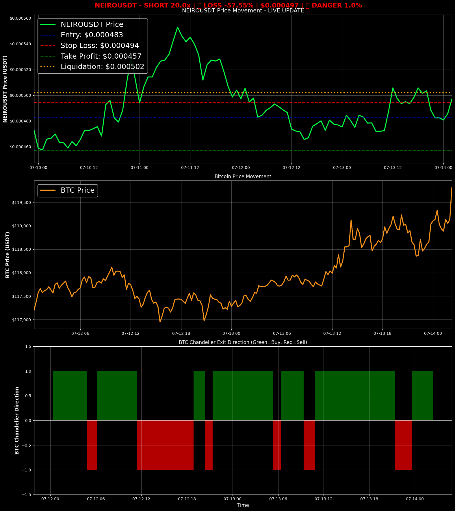
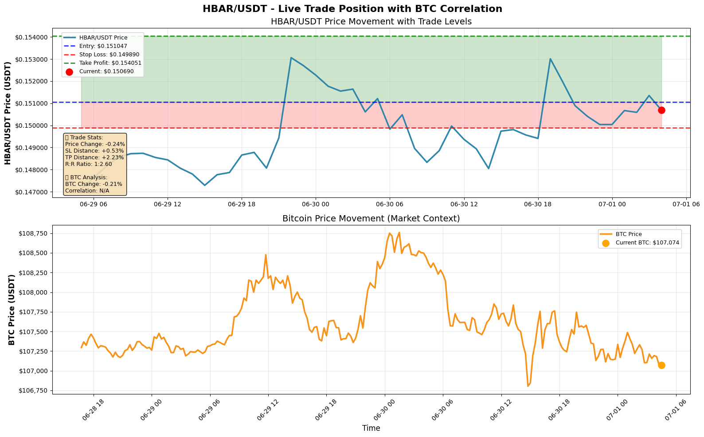

# 🤖 CrypBot: Automated Cryptocurrency Futures Trading Bot

A production-ready Python trading bot for **Binance Futures** that uses automated technical analysis and robust risk management to execute trades.

---

## 🎯 Project Overview

This repository contains an automated trading system designed to operate on **Binance USDT perpetual futures contracts**.  
The bot integrates a **multi-indicator strategy** to identify and act on trading opportunities, featuring a **high-frequency monitoring system** and **dynamic risk controls** based on market volatility.




---

## ✨ Key Features

- **Multi-Indicator Strategy**  
  Combines **Support/Resistance levels** with the **Chandelier ZLSMA** for trend-confirmed entry signals.

- **Dynamic Risk Management**  
  Implements **ATR (Average True Range)** to set adaptive stop-loss and take-profit levels based on volatility.

- **High-Frequency Monitoring**  
  A self-monitoring loop checks open positions at sub-second intervals (configurable) for precise exit management.

- **Automated Execution**  
  Handles order placement, verification, and management with built-in retry logic.

- **Performance Tracking**  
  Includes a **Jupyter Notebook (Dashboard.ipynb)** for real-time and historical trade performance visualization.

---

## 🏗️ Trade Flow Architecture

The bot follows a systematic, event-driven process to execute trades:

```mermaid
graph TD
    A[Scan Coin_List.csv] --> B{Price near S/R Level?};
    B -- Yes --> C{Confirm with Chandelier ZLSMA};
    B -- No --> A;
    C -- Trend Confirmed --> D[Calculate Position Size & SL/TP];
    C -- Trend Not Confirmed --> A;
    D --> E[Execute Trade on Binance];
    E --> F[Enter High-Frequency Monitoring Loop];
    F --> G{SL or TP Hit?};
    G -- Yes --> H[Close Position];
    G -- No --> F;
    H --> I[Log Trade Results];
    I --> A;


CrypBot/
├── 📂 ExecutionHub/                   # Handles trade execution and management
│   ├── DisplayFuture.py               # Renders live chart data
│   └── FutureTradeExecution.py        # Core trade execution engine
├── 📂 IndicatorsHub/                  # Contains all technical indicators
│   ├── Buy_Sell_Pressure_Scanner.py  # Order flow and volume analysis
│   ├── Chandelier_ZLSMA_Filter.py    # Trend-confirming filter
│   ├── Chandelier_ZLSMA.py           # Main trend-following indicator
│   ├── SMC_FGV.py                    # Smart Money Concepts (Fair Value Gaps)
│   ├── SMC.py                        # Smart Money Concepts (Market Structure)
│   ├── Support_Resistance_Future.py  # S/R level detection
│   └── Up_Down_Trend_Scanner.py      # General trend direction scanner
├── Dashboard.ipynb                   # Performance monitoring dashboard
├── Live_Trade_Future.ipynb           # Main notebook for live trading
├── requirements.txt                  # Dependencies
└── Coin_List.csv                     # List of trading pairs
